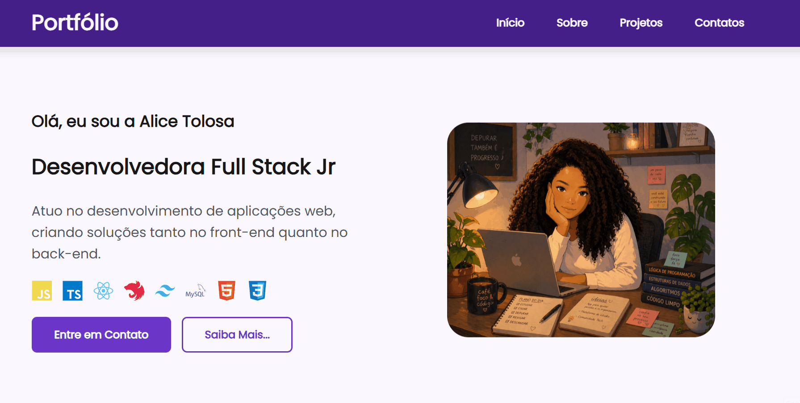

# 💜 Portfólio Pessoal

Este é o meu portfólio pessoal, desenvolvido com o objetivo de apresentar minhas habilidades como desenvolvedora Full Stack, meus projetos e minha evolução na área de tecnologia.

Este portfólio representa minha trajetória profissional e foi construído com dedicação.

---

## 🚀 Tecnologias utilizadas

- **HTML5** → Estruturação semântica  
- **CSS3** → Estilização, responsividade e animações  
- **JavaScript (ES6+)** → Interatividade, consumo de APIs e validações  
- **Swiper.js** → Carrossel de projetos  
- **FormSubmit** → Envio de e-mails via formulário  
- **GitHub API** → Dados dinâmicos de perfil e repositórios  

---

## 📸 Preview 

---

## ✨ Funcionalidades atuais

- Estrutura baseada em **HTML semântico**
- Estilização moderna com **CSS**
- Integração com a **API do GitHub**, permitindo:
- Exibição dos projetos em **carrossel interativo** com **Swiper.js**
- **Formulário de contato com validação no frontend**
- Página de **confirmação de envio**

---

## 🔧 Em desenvolvimento

Este projeto está em constante evolução. Próximas melhorias:

- 🔗 Consumo de API do GitHub
- 🎠 Carrossel de projetos com Swiper
- ✅ Validação de formulário
- 📩 Envio de e-mail pelo formulário
- 🌐 Deploy com GitHub Pages

---

## 👩‍💻 Sobre mim

Me chamo Alice Tolosa e sou desenvolvedora Full Stack em formação.

Tenho perfil analítico e gosto de entender profundamente os problemas para encontrar soluções eficientes. Estou sempre em busca de evolução contínua, aprendendo e colocando em prática novos conhecimentos.

---

## 📬 Contato

- LinkedIn: https://www.linkedin.com/in/alice-oliveira81
- GitHub: https://github.com/alicetolosa
- Email: aliceoliveira81@outlook.com

